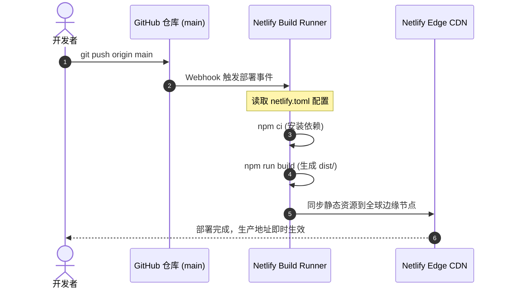

# Resumify — 高质感简历生成器

Resumify 是一款基于 **React 19 + Vite** 构建的现代化高质感简历生成器。采用左右双栏响应式设计，左侧提供模块化表单与样式排版控制，右侧提供高保真实时 A4 预览与自动跨页排版。原生支持客户端矢量化 PDF 导出与 JSON 数据全量备份，深度集成 Netlify 持续集成 (CI/CD) 自动化构建与全球 CDN 部署。

**🔗 在线体验：[https://resumify-li.netlify.app/](https://resumify-li.netlify.app/)**

---

## 架构设计与系统概览

```mermaid
graph TD
    A[用户操作] --> B[左侧编辑器面板 EditorPanel]
    A --> C[右侧实时预览区 PreviewPanel]
    
    subgraph StateManagement [集中式状态引擎 ResumeContext]
        D[ResumeState 数据流]
        E[LocalStorage 本地持久化 (防抖)]
        F[JSON 导入 / 导出校验]
    end

    B -->|Action 触发| D
    D -->|状态广播| C
    D -->|自动保存| E

    subgraph PreviewEngine [多页渲染与排版引擎]
        C --> G[7 大排版模版组件]
        G --> H[A4 边界计算与多页分页]
        H --> I[续页智能页眉绑定]
    end

    subgraph ExportSystem [导出与交付流水线]
        C --> J[html2canvas + jsPDF]
        J --> K[高清 A4 多页无损 PDF]
    end
```

---

## 技术栈清单

| 分层维度 | 技术选型 | 版本 / 说明 |
|---|---|---|
| **核心框架** | React 19 | 最新稳定版，高效 Hooks 驱动与并发渲染支持 |
| **构建工具** | Vite 6 | 秒级冷启动、极致 HMR 热更新与分包 Tree-shaking |
| **状态流转** | React Context + Custom Hooks | 集中式单向数据流、细粒度原子 Action 更新 |
| **图标体系** | Lucide React | 原生 SVG 组件按需加载，零 DOM 运行时扫描开销 |
| **多媒体与导出** | html2canvas + jsPDF | 客户端多页矢量拼接、中文无乱码排版与高清打印适配 |
| **设计系统** | Warm-Canvas CSS Tokens | 包含 10 种配色、3 种字体层级、3 种间距系统与响应式断点 |
| **测试框架** | Vitest + Testing Library | 极速组件测试与状态数据模型校验 |
| **CI/CD & 托管** | Netlify + GitHub Actions | 自动化提交构建、全球边缘 CDN 分发与 SPA 路由保护 |

---

## 核心数据模型 (ResumeState)

```typescript
interface ResumeState {
  personal: {
    name: string;
    title: string;
    avatar: string;
    email: string;
    phone: string;
    location: string;
    website: string;
    github: string;
    linkedin: string;
    age: string;
    gender: string;
    arrivalTime: string;
  };
  summary: string;
  experience: Array<{
    id: string;
    company: string;
    role: string;
    startDate: string;
    endDate: string;
    description: string;
  }>;
  education: Array<{
    id: string;
    institution: string;
    degree: string;
    major: string;
    startDate: string;
    endDate: string;
    description: string;
  }>;
  projects: Array<{
    id: string;
    name: string;
    role: string;
    link: string;
    startDate: string;
    endDate: string;
    techStack: string;
    description: string;
  }>;
  skills: Array<{
    id: string;
    category: string;
    tags: string;
  }>;
  sectionOrder: string[];
  sectionVisibility: Record<string, boolean>;
  sectionColumns: Record<string, 'left' | 'right'>;
  theme: string;
  font: string;
  spacing: string;
  template: 'modern' | 'elegant' | 'sidebar' | 'geek' | 'minimal' | 'creative' | 'compact';
}
```

---

## 项目目录结构

```
resume-generator/
├── index.html                    # Vite HTML 挂载模版
├── vite.config.js                # Vite 构建、分包策略与 Vitest 配置
├── netlify.toml                  # Netlify CI/CD 自动化构建与重定向规则
├── package.json                  # 项目依赖与 Scripts
├── styles.css                    # Warm-canvas 设计系统 Tokens 与排版样式
├── src/
│   ├── main.jsx                  # React 应用挂载入口
│   ├── App.jsx                   # 左右分栏响应式工作台
│   ├── constants/
│   │   └── defaultState.js       # 预设数据、表单字段元数据与模版枚举
│   ├── context/
│   │   └── ResumeContext.jsx     # 全局状态管理、防抖本地持久化与提示系统
│   ├── components/
│   │   ├── common/               # 通用组件 (Toast、头像裁切模态框)
│   │   ├── editor/               # 左侧编辑面板与表单集合
│   │   └── preview/              # 右侧实时 A4 预览与 7 大模版
│   └── utils/
│       ├── pagination.js         # A4 页面高度算法与缓存管理
│       ├── pdfExport.js          # 高保真多页 PDF 导出引擎
│       └── storage.js            # LocalStorage 存取与防污染合并
└── tests/                        # 单元测试与端到端交互测试套件
    ├── state.test.js
    ├── pagination.test.js
    └── components.test.jsx
```

---

## 环境搭建与本地开发指南

### 1. 安装环境要求
- **Node.js**: `>= 18.0.0`
- **包管理器**: `npm` 或 `pnpm`

### 2. 本地开发
```bash
# 克隆仓库
git clone https://github.com/e69d8e/resume-generator.git
cd resume-generator

# 安装依赖
npm install

# 启动本地开发服务器 (支持秒级热更新)
npm run dev
```
启动后在浏览器打开 `http://localhost:5173/` 即可开始编辑。

### 3. 执行测试与生产构建
```bash
# 执行自动化单元与组件测试
npm test

# 执行生产环境优化构建 (产物输出至 dist/ 目录)
npm run build

# 本地预览生产构建产物
npm run preview
```

---

## GitHub + Netlify 自动化持续部署指南

本项目已内置标准的 `netlify.toml` 构建配置，推送到 GitHub 后将自动触发 Netlify 线上部署。

### 部署时序图



### 部署操作步骤

1. **推送代码至 GitHub 仓库**：
   ```bash
   git add .
   git commit -m "feat: refactor to React 19 + Vite and configure Netlify CI/CD"
   git push origin main
   ```

2. **在 Netlify 中绑定仓库（若尚未绑定）**：
   - 登录 [Netlify 官网](https://app.netlify.com/)。
   - 点击 **Add new site** -> **Import an existing project**。
   - 选择 **GitHub** 并授权选择 `resume-generator` 仓库。
   - Netlify 会自动检测到根目录的 `netlify.toml`，自动填入：
     - **Build command**: `npm run build`
     - **Publish directory**: `dist`
   - 点击 **Deploy resumify** 即可。

3. **后续全自动更新**：
   - 每次向 `main` 分支执行 `git push`，Netlify 将在 1 分钟内全自动拉取、构建并发布最新版本，无需手动登录面板操作。

---

## 浏览器支持

| Chrome | Edge | Firefox | Safari |
|---|---|---|---|
| >= 90 | >= 90 | >= 88 | >= 14 |

---

## 许可证

本项目遵循 [MIT License](LICENSE)。
